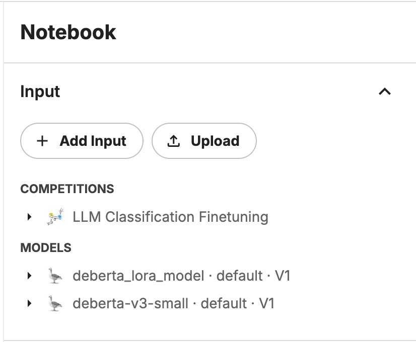

# proj2

### step1 and step2

step1은 답변의 글자 수만 가지고 처리하는 기본 baseline 입니다.
step2는 embedding 모델을 사용해야 하는데 step3에서 적용한 방식으로 변경해야하는데 아직 못했습니다.

### step3에 대하여

step3-1과 step3-2 2가지 방법을 시도 하였습니다.
step3_1_keras.ipynb 파일은 kaggle에서 keras로 모델을 불러온 후 fine-tuning하여 제출하는 전체 과정입니다. 제출해서 결과가 나오는데 37분이 소요되었고 step1 baseline보다 낮은 score를 얻었습니다.

step3_2_lora_submission.ipynb와 step3_2_lora_training.ipynb는 모델을 따로 학습 시켜서 kaggle에 업로드하여 실행하고자 한 파일입니다.

1. training 파일에서 모델을 학습 시킨 후 모델 파일을 만듭니다.
2. lora로 fine-tuning하면 결과 파일들이 만들어집니다. 해당 파일들을 폴더로 만들어서 업로드합니다.
3. 기존 모델인 deberta-v3-small 모델 추가
4. calibration하는 부분을 추가하기는 하였는데 성능 증가에 도움이 되는지 까지는 확인하지 못했습니다.
   
   이런 식으로 submission 할 때 모델을 업로드한 후에 submission을 수행합니다.

### 했던 일

-   sentence-transformer로 모델을 kaggle에서 다운받아서 하려고 하였지만 인터넷 연결을 끊으면 모델을 다운 받을 수 없어서 안됨
-   kaggle에서 모델을 불러올 수가 있어서 모델을 불려와서 하려고 하였지만 그러면 제출했을 때 채점 서버에서 fine-tuning을 하게 되어서 제출이 40분 가량 걸림
-   quantization을 적용하고 싶었지만 train 할 때 에러가 너무 많이 나서 적용하지 못했음

### 할 일

-   training에서 prompt 만드는 방식 변경
    '''python # 텍스트 생성 (handle batched input)
    examples['text'] = [("prompt: " + prompt +
    "\n\nresponse_a: " + response_a +
    "\n\nresponse_b: " + response_b) for prompt, response_a, response_b in zip(examples['prompt'], examples['response_a'], examples['response_b'])]
    '''
-   하이퍼파라미터 수정
-   calibration 하는 부분도 저장해서 로드 시키면 채점 시간이 빨라질 것 같기는 하지만 꼭 필요한지는 모르겠음
